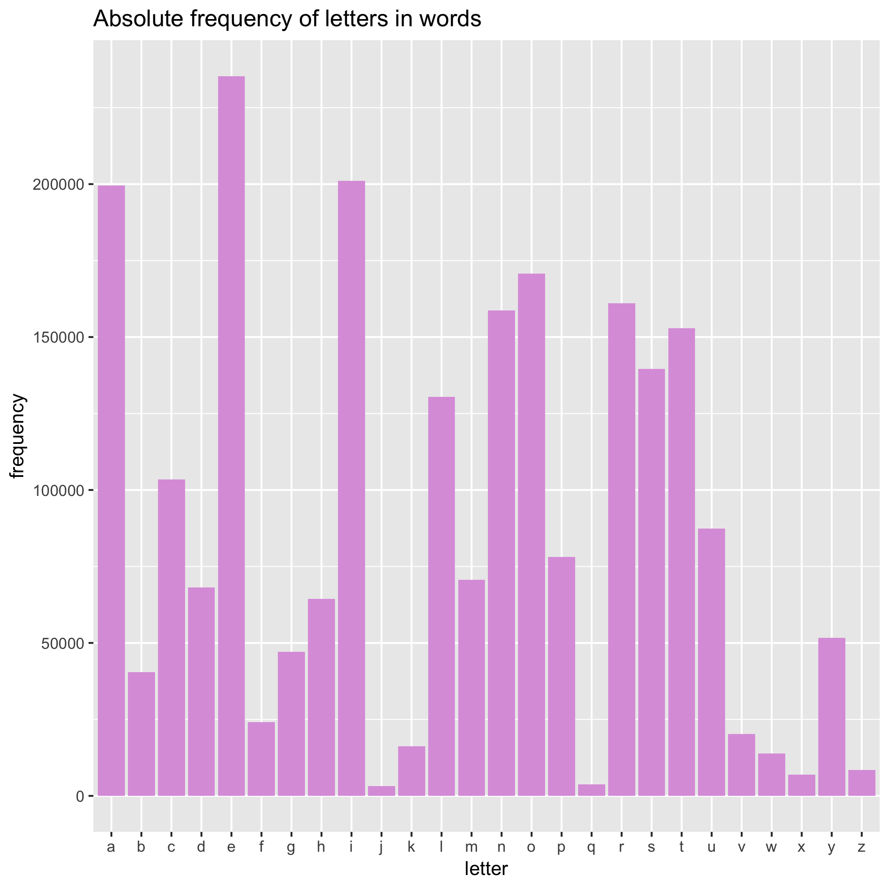

```{r setup, include=FALSE}
knitr::opts_chunk$set(echo = TRUE, fig.align = "center")
```

Hello! :raising_hand:

This is the repository of my Homework 9: Automating Data-analysis Pipelines for the [STAT547](http://stat545.com) course.
	Instructions for this assignment can be found [here](http://stat545.com/Classroom/assignments/hw09/hw09.html)

For this assignment, I modified Jenny Brian's original [make activity](https://github.com/STAT545-UBC/make-activity) by adding new files to the pipeline. 

## New files
* [letteres_freq.R](./R/letters_freq.R) outputs a tsv file containing the frequencies of letters in the `words.txt` file.
* [report_letter_freq.rmd](report_letter_freq.Rmd) which outputs the [report_letter_freq PDF](report_letter_freq.pdf).
* [README.rmd](README.rmd) which generates the README.md file with the Frequency of letters plot:


## Makefile
To review my makefile:
:star2:[Makefile](Makefile)

I modified the Makefile to add the new files to the pipeline to generate the new plot and report, the README,
and subdirectories to store the images (plots), the data outputs (csv files) and the source data (words.txt file).


